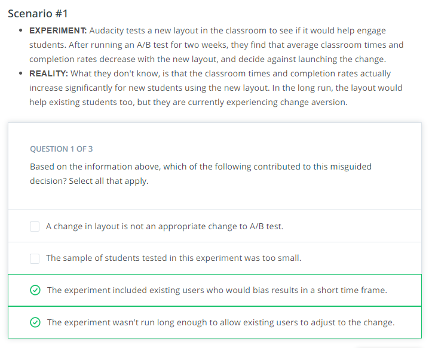
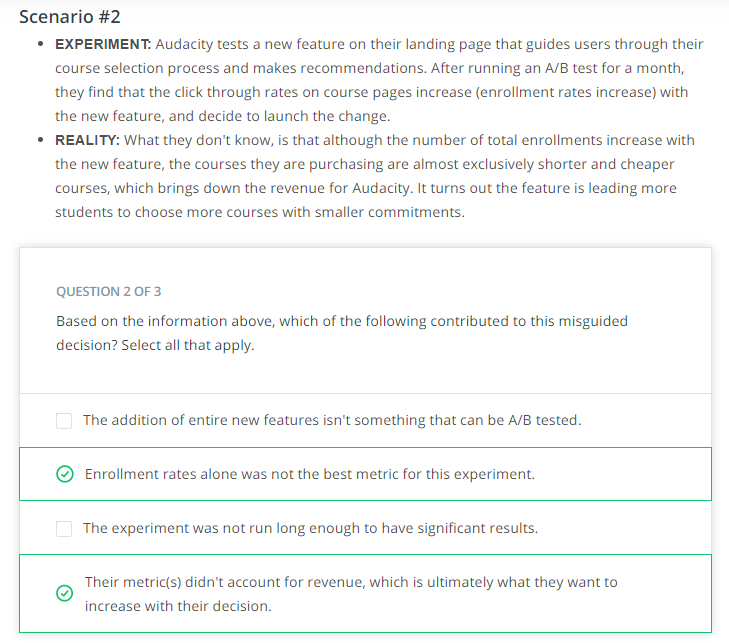
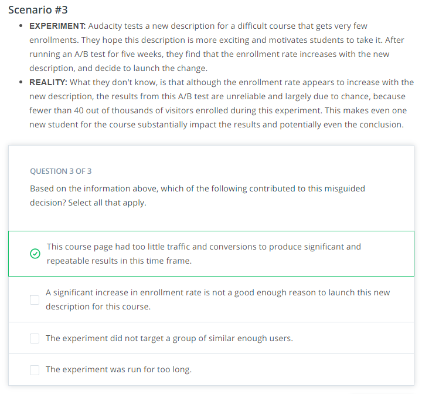

# Difficulties in A/B Testing

Being able to determine the statistical significance of performance differences in A/B test results is valuable. However, there are many other factors to consider to ensure your A/B tests are successful. In the real world, designing, running, and drawing conclusions from an A/B test to lead you to the right decisions can be tricky.

In the following quizzes, you'll find three scenarios where Audacity conducted an A/B test that led to a poor decision. Think about what went wrong and what could've been done to avoid these outcomes.

### Difficulties in A/B Testing
As you saw in the scenarios above, there are many factors to consider when designing an A/B test and drawing conclusions based on its results. To conclude, here are some common ones to consider.

* Novelty effect and change aversion when existing users first experience a change
* Sufficient traffic and conversions to have significant and repeatable results
* Best metric choice for making the ultimate decision (eg. measuring revenue vs. clicks)
* Long enough run time for the experiment to account for changes in behavior based on time of day/week or seasonal events.
* Practical significance of a conversion rate (the cost of launching a new feature vs. the gain from the increase in conversion)
* Consistency among test subjects in the control and experiment group (imbalance in the population represented in each group can lead to situations like [Simpson's Paradox](https://en.wikipedia.org/wiki/Simpson%27s_paradox))

[watch video:conclusion](https://www.youtube.com/watch?v=qmGjRpMVBz8)
