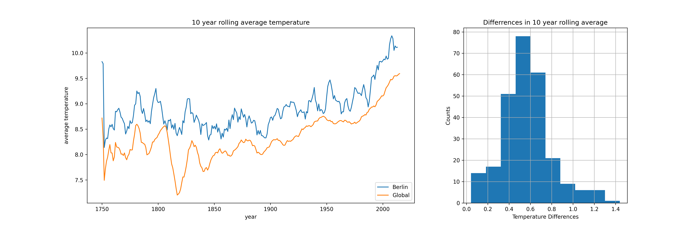

# Solution

# Extract Data Using SQL From Udacity Workspace

The data is available on udacity workspace. Only students from this course can directly download from it. Below codes were used to extract the data for this project. The extracted data are available on github.


```sql
-- download global data
SELECT * FROM global_data;

-- download Berlin data
SELECT *
FROM city_data
WHERE city = 'Berlin';

```

# Line chart

**Chart 1**


**Chart 2**


# observations

* What's the differences of the line plots among all the rolling scale, 5 rolling average, 10 rolling average, etc.?

In both Berlin and Global plots, the larger scale of rolling window, the smoother the line becomes. The 5 year rolling average line in Berlin was much wavier compared to the global 5 year rolling average line.

* How do the changes in your city’s temperatures over time compare to the changes in the global average?

Temperature of Berlin and Global were both increasing over the years. The slope of increase were much higher after 1950s.

* What does the overall trend look like? Is the world getting hotter or cooler? Has the trend been consistent over the last few hundred years?

It became hotter over the years, but there was exception at around 1810s. In the world, the average temperature was 8.3 in 1800s, then it dropped to 7.3 in 1810s. During this time, Berlin maintained at 8 degree.

* Is your city hotter or cooler on average compared to the global average? Has the difference been consistent over time?
The 10 year rolling average linechart shows Berlin is above global average in general. In general, Berlin is 0.5 degree more than the global temperature. The largest difference was at 1819, where the average rolling differences in the past decade was 1.28, being Berlin is 1.28 degree hotter than global.
